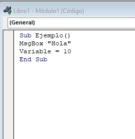

# Agenda
Mis apuntes

### Inicio y final
Para iniciar un programa en Excel es necesario el Sub () yendo entreparéntesis el nombre del programa.
Para terminar el programa es necesario el End Sub al final de el código.
>Sub Ejemplo
>.
>.
>.
>End Sub

### Cajas de texto
Para las cajas de texto debemos colocar el comando msgbox "" seguido de el texto que queramos añadir.
>msgbox "ejemplo"

### Variables
Para crear variables debemos darle un nombre a la variable seguido de "=", (si la variable que queremos colcoar es un texto
debe estar cerrada entre comillas)
>ejemplo = 10

### Evidencia

